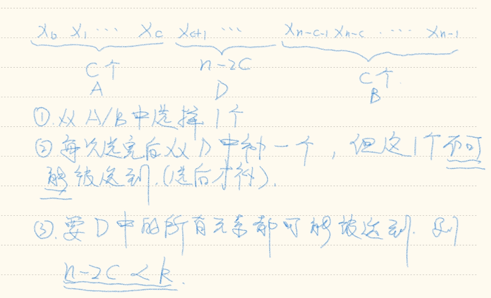

---
tags:
  - Leetcode
  - Algorithm
---

# Total Cost to Hire Workers

## Conclusions

令`n = cost.len()`, `c = candidates`, 则有如下结论.

**结论1**: 若`c * 2 + k > n`, 则答案为, *cost中最小的`k`个数之和*

证明:



**结论2**: 算法运行结束后`j + 1 >= i`, 即*一个数字不会被入堆两次*

证明:

首先有 `c * 2 + k <= n`. 假设从左边选`x`个, 从右边选`y`个, 有`x + y = k`.

```txt
i = c + x
j = n - 1 - c - (k - x) 
  = n - 1 - c - k + x
  <= c * 2 + k - 1 - c - k + x
  = c + x - 1
```

## Code

```rust
/// runs in O(nlogn)/O(n)
pub fn total_cost(mut costs: Vec<i32>, k: i32, candidates: i32) -> i64 {
    let n = costs.len();
    let c = candidates as usize;
    let k = k as usize;

    assert!(n >= k && n >= c, "break constraints");

    if c * 2 + k > n {
        costs.sort_unstable();
        return costs.iter().take(k).map(|&x| x as i64).sum();
    }

    let mut pre = std::collections::BinaryHeap::new();
    let mut suf = std::collections::BinaryHeap::new();

    for i in 0..c {
        pre.push(-costs[i]);
        suf.push(-costs[n - 1 - i]);
    }

    let mut ret = 0;

    let mut i = c;
    let mut j = n - 1 - c;
    for _ in 0..k {
        if pre.peek().unwrap() >= suf.peek().unwrap() {
            ret -= pre.pop().unwrap() as i64;
            pre.push(-costs[i]);
            i += 1;
        } else {
            ret -= suf.pop().unwrap() as i64;
            suf.push(-costs[j]);
            j -= 1;
        }
    }

    ret
}
```

明确的说/明确的感觉到 -> The end. Don't think more.
