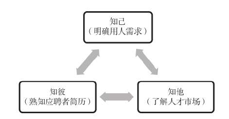
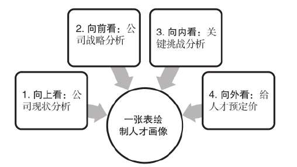
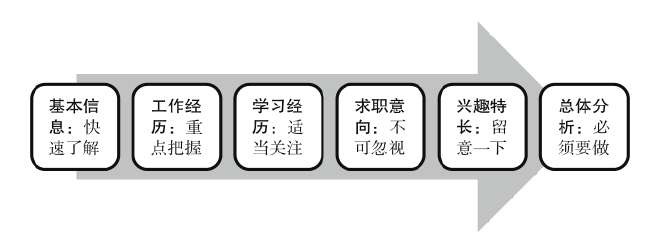
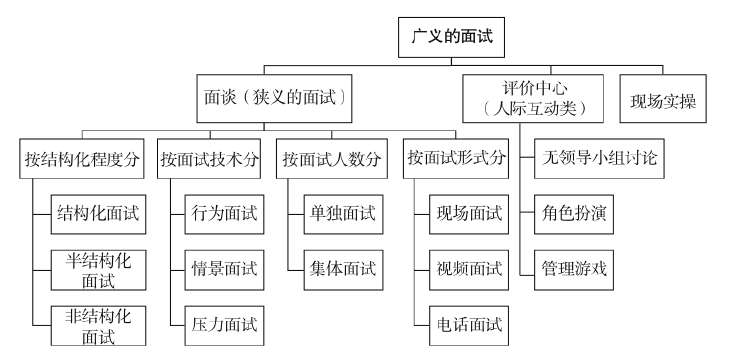
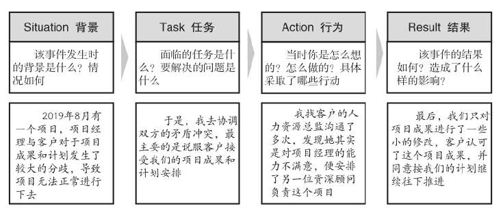
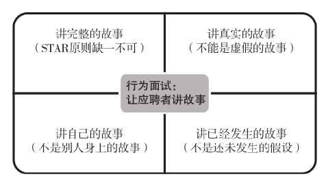
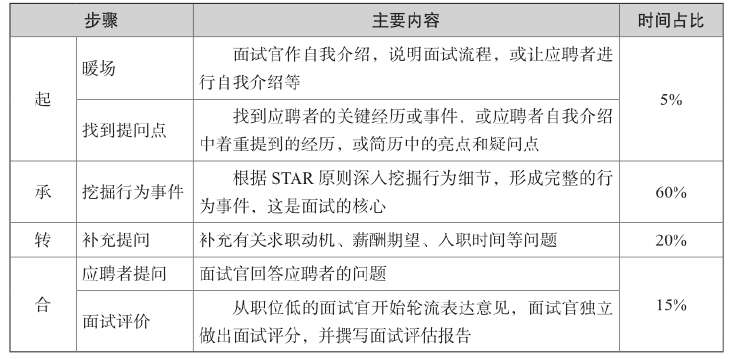

---
tags:
  - Reading
---

# 超级面试官

## 超级准备: 你要招什么样的人

1. 招人要有清晰的标准
2. 适合的才是最好的
3. 看人要看内在品质
   1. 知识/经验/技能 -> 能力/个性/动机/价值观

### 准备面试

### 人才画像

### 看透简历

## 超级流程: 面试方法

行为面试、情景面试和压力面试

行为面试的基本假设是： 一个人的行为模式是相对稳定的，不会在较短的时间内发生大的变化，特别是在遇到类似的情景时，人的行为反应倾向于重复过去的方式.

行为面试STAR

- Situation
- Task
- Action
- Result

情景面试是1982年由美国学者兰瑟姆定义的，它是通过设置工作中的各种典型情景，让应聘者在特定情景中扮演某个角色，完成一定的任务，从而考察其实际工作能力的一种面试方法。

压力面试是指面试官有意制造紧张气氛，了解应聘者将如何面对工作压力的面试方法。面试官通过提出生硬的、不礼貌的问题故意使应聘者感到不舒服，针对某一事项或问题做一连串的发问，直至应聘者无法回答

面试官采用行为面试法最大的难题就是怎么问对问题才能科学准确地考察应聘者的真实能力。这一方法的特点是让应聘者回忆过去的经历，通俗地说就是让应聘者讲故事，讲完整的故事，讲真实的故事，讲自己的故事，讲已经发生的故事（如图3-5所示）。为了达到这样的目的，面试官必须有效发问和追问，用尽量少的提问获取应聘者尽可能多的、有效的、真实的信息，这就体现了面试官提问的水平。

### 四段式情景化行为面试法

承：挖掘行为事件

面试官对不同类型应聘者的处理原则

提问的时候，面试官还需要注意以下几点。

1. 一次只提出一个问题，不要一次提出多个问题。
2. 提问尽量简短，不要问太长的问题。
3. 避免使用有歧义的语言，尽量少用专业性太强的词汇。
4. 要问准、问实，要弄清楚应聘者的真实情况和意图。
5. 对于难度大的问题，面试官要给予适当启发或给应聘者留出充足的思考时间。

转：补充提问

面试官转移话题的话术

## 超级提问: 问对问题

无效的面试问题

无效的面试问题

### 面试的关键在关键事件

培训界有一个“721法则”，即能力提升的70%来自工作实践中的锻炼，20%来自向有经验的人学习，10%来自培训课堂和书本的学习

面试官要了解一个人的能力，最关键的就是要把握那些与应聘岗位相近的关键事件

关键事件来源于招聘岗位的关键挑战和应聘者的关键经历

情景化行为面试提问示例

面试提纲

## 超级追问：打破砂锅问到底

应聘者自我包装的五种表现

面试追问的三个步骤

面试追问中需要留意的关键字眼

### 5W2H方法

- What:发生了什么事情？面临的任务是什么？要解决的问题是什么？结果如何？造成了- 什么样的影响？
- When：什么时候发生的？什么时间开始？什么时候结束？多长时间一次？Where：在哪里发生的？
- Who：哪些人参与了？你的角色是什么？
- Why：为什么会发生这样的事？为什么要这么做？当时你是怎么想的？
- How：你是怎么做的？具体经过是怎样的？
- How many/much：花了多少钱？用了多长时间？

## Reference

- <https://zhuanlan.zhihu.com/p/588176381>
