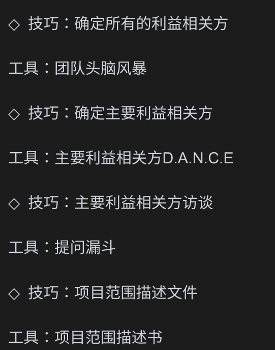
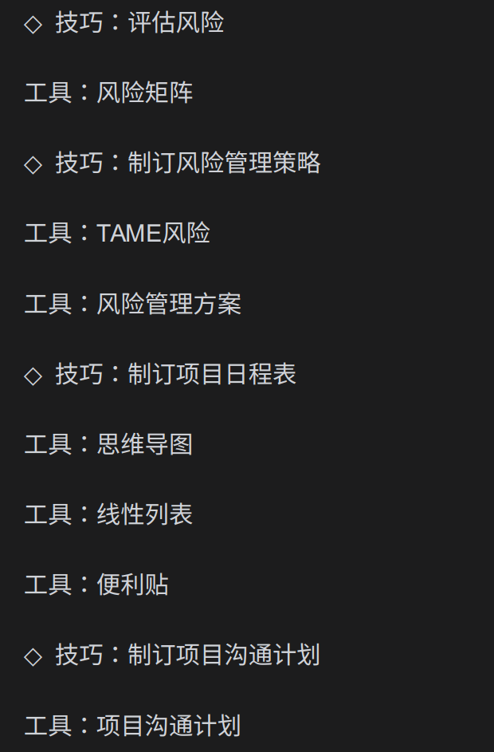
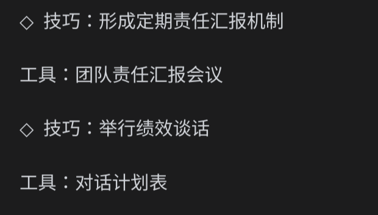
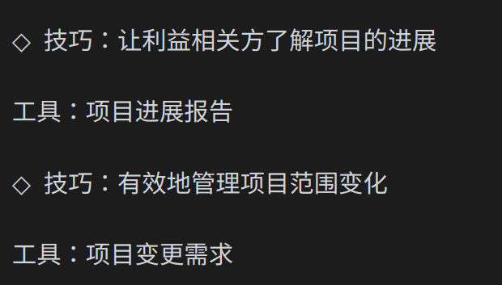
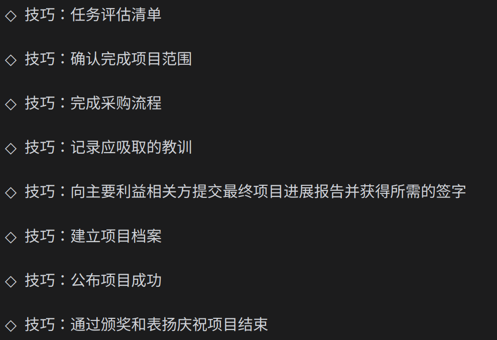

---
tags:
  - Reading
---

# 项目管理精华

人 + 流程 = 成功

- 人: 带领团队, 非正式权利(使人们能够自愿留在你的团队), 四个基本行为准则(展现尊重,先聆听,明确期望,承担责任)
- 流程: 发起 -> 规划 -> 执行 -> 监管与控制 -> 结束

## 发起

将预期量化, 传达给成员以达成共识 -> 决定项目的成败

了解每个人的预期是什么

- 利益相关方: 积极参与到项目中, 或会因项目产生正面或负面影响的人或组织
- 主要利益相关方: 任何一个决定项目成功或者失败的人

### D.A.N.C.E

如何确定主要利益相关方

### 访谈工具

## 规划

## 执行

## 监管与控制

## 结束

## 思考

- 清晰的传达/理解项目的预期.
  - 作为团队成员, 积极理解项目的预期
  - 作为管理者, 积极传达项目的预期

案例: zstudio pingpong生成

- 预期: 生成和pingpong模板一致的代码 -> 按照模板去生成代码 -> 代码写的比较死板, 没有扩展性
- 预期: 生成和pingpong结构一致的代码 -> 量化目标: run起来 -> 结构合理有扩展性的代码
